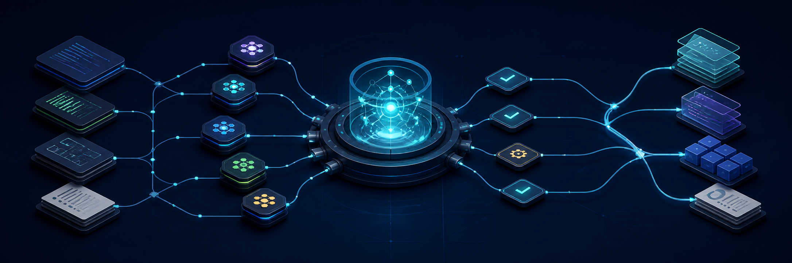

<p align="center">
  
</p>

# DSH Project Harness

[](LICENSE)
[](SKILL.md)

Turn a new or existing repository into an agent-ready project with layered instructions, explicit team ownership, durable decision records, change plans, and proportionate quality checks.

`dsh-project-harness` packages the transferable engineering workflow behind DeepSeek Harness into a reusable Codex skill. It adapts to the target repository instead of copying DSH-specific package names, commands, or release rules.

## Why this exists

An `AGENTS.md` file helps, but it is not a complete development system. Agent-heavy projects also need a clear home for architecture facts, execution plans, durable rationale, teammate handoffs, review procedures, and evidence that matches the changed surface.

This skill connects those pieces while keeping them separate enough to stay maintainable:

- Root and subtree `AGENTS.md` files for standing instructions.
- Confirmed lessons and recurring failure classes promoted into rules with evidence links.
- Architecture and development docs for current-state facts.
- Agent Notes for decisions, rejected alternatives, and consequences.
- Change plans and handoffs for work that is still moving.
- Project-local review and pre-push skills for situational workflows.
- Lead-owned integration with task dependencies and advisory write scopes.
- Non-destructive initialization that skips existing files by default.

## Install

Requirements:

- Codex with local skill discovery.
- Python 3.9 or newer for the initializer.
- Git when initializing an existing repository.

Clone the skill into your Codex skills directory:

```bash
git clone https://github.com/Pytorchlover/dsh-project-harness.git \
  "${CODEX_HOME:-$HOME/.codex}/skills/dsh-project-harness"
```

Start a new Codex task and invoke it explicitly:

```text
Use $dsh-project-harness to initialize this repository for agent-driven development.
```

The skill also supports automatic discovery for repository-harness, `AGENTS.md`, collaboration, change-documentation, and review-workflow requests.

## Quick start

Preview the files that would be created:

```bash
python3 "${CODEX_HOME:-$HOME/.codex}/skills/dsh-project-harness/scripts/init_project_harness.py" \
  /path/to/repository \
  --project-name "My Project" \
  --dry-run
```

Initialize after reviewing the preview:

```bash
python3 "${CODEX_HOME:-$HOME/.codex}/skills/dsh-project-harness/scripts/init_project_harness.py" \
  /path/to/repository \
  --project-name "My Project"
```

The initializer detects common npm, pnpm, Yarn, Bun, Python, Rust, and Go project commands. It marks anything it cannot prove with a visible `TODO` instead of inventing a command.

## What it creates

| Path | Purpose |
|---|---|
| `AGENTS.md` | Repository-wide standing instructions and definition of done |
| `docs/architecture.md` | Current component ownership, execution flow, state, and boundaries |
| `docs/development.md` | Setup, daily commands, CI links, and contribution flow |
| `.agents/notes/README.md` | Decision-note lifecycle, classification, and format |
| `.agents/plans/README.md` | Active and completed execution-plan policy |
| `.agents/templates/agent-note.md` | Proposal/decision record template |
| `.agents/templates/change-plan.md` | Task DAG, ownership, write scope, validation, and rollback template |
| `.agents/templates/handoff.md` | Exact continuation state, evidence, risks, and next action |
| `.agents/skills/project-code-review/SKILL.md` | Repository-local semantic review workflow |
| `.agents/skills/project-pre-push-checks/SKILL.md` | Smallest credible outgoing-change checks |
| `.agents/.gitignore` | Keeps local overwrite backups out of version control |

Run the initializer a second time to verify idempotence. Existing destinations are reported as `SKIP` and left untouched.

## Safety model

The script refuses to initialize a subdirectory of an existing Git repository; pass the actual repository root. It never overwrites existing files unless `--overwrite` is explicitly supplied.

When overwrite mode is deliberately used, every replaced file is backed up first:

```bash
python3 scripts/init_project_harness.py /path/to/repository --overwrite
```

Backups are written under `.agents/harness-backups/<timestamp>/` and ignored by the generated `.agents/.gitignore`. For a mature repository, prefer a Codex-guided gap audit and merge over wholesale replacement.

## The harness model

The skill uses five cooperating layers:

1. **Standing instructions** — compact root rules, confirmed lessons promoted from incidents, plus only the nested rules that genuinely differ.
2. **Current-state documentation** — one maintained home for architecture, development, package, and user facts.
3. **Decision records** — durable motivation, decisions, real rejected alternatives, and consequences.
4. **Workflow skills** — review, pre-push, documentation, release, or other procedures loaded only when relevant.
5. **Executable evidence** — focused local checks for the affected surface, with exhaustive matrices owned by CI.

Team coordination overlays these layers. The lead partitions work into independently useful outcomes, records dependencies and advisory write scopes, waits for required work, reviews the combined diff, and owns final integration.

Confirmed lessons are promoted into short rules in the owning `AGENTS.md` or module document. A failure class that recurs across components gets one defect-class document linked from the root file, ordered by defect class and never by date, while incident narrative stays in the report that owns it.

See [the harness architecture](references/harness-architecture.md) for the ownership map and the DSH-specific rules that are intentionally not copied.

## Common requests

```text
Use $dsh-project-harness to audit this repository's current agent workflow and propose only the missing pieces.
```

```text
Use $dsh-project-harness to write a root AGENTS.md and scoped frontend instructions from the live repository.
```

```text
Use $dsh-project-harness to create a change plan, decision note, and teammate work partition for this feature.
```

```text
Use $dsh-project-harness to review whether this branch has the right documentation and validation evidence.
```

```text
Use $dsh-project-harness to turn this repository's incident reports into confirmed rules and one failure-mode document.
```

## Repository structure

```text
dsh-project-harness/
├── SKILL.md                       Skill entry point and routing
├── agents/openai.yaml             Codex UI metadata
├── references/                    Focused harness guidance
├── scripts/init_project_harness.py
└── assets/
    ├── project-harness/           Files copied into target repositories
    └── readme/hero.png            README artwork
```

## Validate

Validate the skill metadata and frontmatter with Codex's `skill-creator` validator:

```bash
python3 "${CODEX_HOME:-$HOME/.codex}/skills/.system/skill-creator/scripts/quick_validate.py" .
```

You can also exercise the initializer safely against a temporary Git repository. A meaningful test verifies first-run creation, second-run idempotence, overwrite backups, inferred commands, and refusal to initialize a nested Git path.

## Contributing

Issues and pull requests are welcome. Please keep the skill focused on decisions that materially improve repository initialization or agent collaboration:

- Preserve non-destructive defaults and authorization boundaries.
- Add project-specific rules only when they generalize into a clear decision criterion.
- Keep detailed modes in `references/` and the entry point concise.
- Test changed scripts through observable behavior, not wording-only assertions.
- Update this README when installation, generated files, or safety behavior changes.

## Origin and attribution

This project is an independent adaptation of development patterns observed in [DeepSeek Harness](https://github.com/deepseek-ai/deepseek-harness), including layered `AGENTS.md` instructions, Agent Notes, workflow skills, relevant local checks, and lead-owned agent-team integration. It is not an official DeepSeek project and does not copy DSH runtime packages or branding.

The README artwork was generated specifically for this repository with OpenAI's built-in image generation tool.

## License

Licensed under the [MIT License](LICENSE).

## 中文简介

`dsh-project-harness` 用于把新仓库或现有仓库整理成适合 Agent 协作开发的项目：包含分层 `AGENTS.md`、架构与开发文档、Agent Note 决策记录、执行计划、团队任务划分、代码审查和按影响面选择的质量检查。

初始化默认不会覆盖已有文件；对成熟项目，推荐直接让 Codex 调用该 skill，先检查现有规范，再只补齐缺失部分。

## Lean maintenance and migration

Keep the default architecture/development split; add specialized contracts or
experiment reports only when useful. No mandatory memory hierarchy, full-file
index, timestamp headers or decision note per experiment. Confirmed lessons go
into the owning rules, while incident evidence stays in its report; a recurring
cross-component failure class gets one defect-class document linked from the root
file. See [maintenance and migration](references/lean-maintenance.md).

Check affected Markdown links with:

```sh
python3 scripts/check_docs.py /path/to/repository docs AGENTS.md
```

The checker validates local link destinations, including project-specific source
directories. It does not prove prose freshness, symbols, anchors or command
correctness. Without explicit paths it checks tracked root/docs/notes/plans
Markdown; pass paths for untracked new files.

Run behavioral regression checks with `python3 -m unittest discover -s tests -v`.

中文：默认不增加 memory、全量索引或日期维护体系。已确认的经验写入适用的
AGENTS.md 或模块说明，过程与证据留在实验报告；跨组件复发的失败类别集中为一个
按缺陷类别组织的规则文档，由根 AGENTS.md 一行链接。普通调参不要求逐项写决策。
已有文档通过梳理、合并和链接修复迁移，不用覆盖式初始化。
